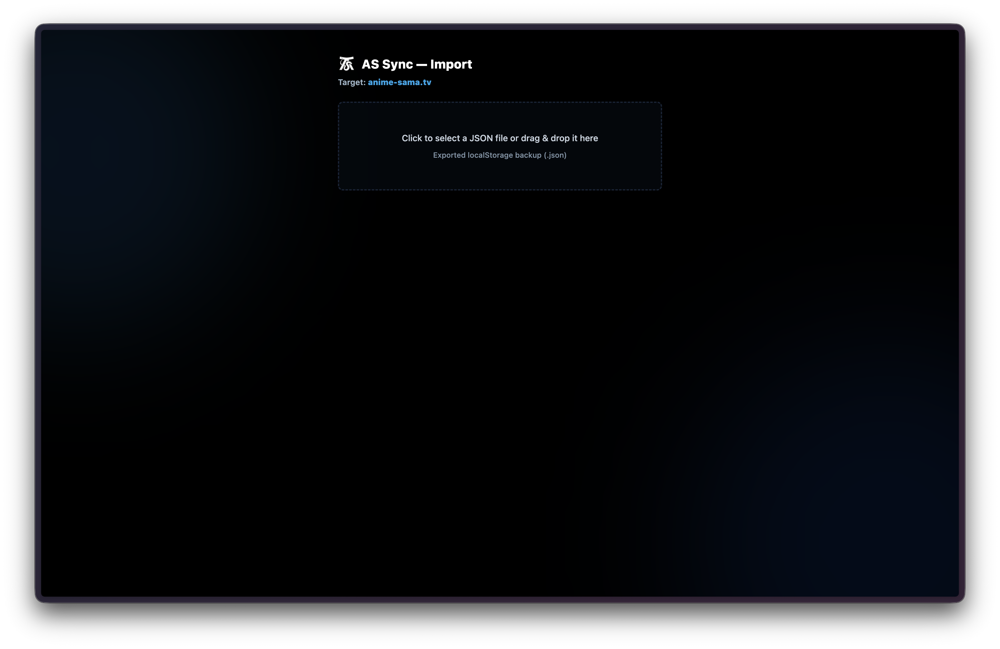

# AS Sync

Extension pour sauvegarder et restaurer votre progression sur anime-sama.tv.

Quand le site change de domaine, vous perdez tout : historique, watchlist, favoris. Toutes ces données sont stockées dans votre navigateur et liées au nom de domaine. AS Sync vous permet de les exporter dans un fichier et de les réimporter sur le nouveau domaine.

**Aucune donnée n'est envoyée sur internet.** Tout reste en local, entre votre navigateur et votre fichier.

## Aperçu

## Fonctionnalités

- **Export** : récupère vos données depuis le site et les enregistre dans un fichier JSON
- **Import** : vous choisissez votre fichier, vous vérifiez son contenu, et l'extension remet tout en place
- **Résumé** : la pop-up affiche un aperçu de vos données (historique, watchlist, favoris)

Le fichier exporté est une copie exacte de vos données. Ce que vous exportez est réimporté tel quel.

## Installation

[Firefox Addons](https://addons.mozilla.org/en-US/firefox/addon/as-sync/)

Chrome Extension...

Téléchargez la dernière version depuis la page [Releases](https://github.com/WaYyTempest/as-sync/releases).

### Firefox

1. Téléchargez le fichier `.xpi`
2. Rendez-vous sur `about:debugging#/runtime/this-firefox`
3. Cliquez sur "Charger un module complémentaire temporaire"
4. Sélectionnez le fichier `.xpi` téléchargé

### Chrome

1. Téléchargez et décompressez le fichier `as-sync-*-chrome.zip`
2. Rendez-vous sur `chrome://extensions`
3. Activez le "Mode développeur"
4. Cliquez sur "Charger l'extension non empaquetée" et sélectionnez le dossier décompressé

## Pour les développeurs

Si vous souhaitez comprendre le fonctionnement du code, corriger un bug ou ajouter une fonctionnalité, consultez le [README-DEV.md](README-DEV.md).

## Licence

[MIT](LICENSE)

## Auteur

[WaYyTempest](https://github.com/WaYyTempest)
